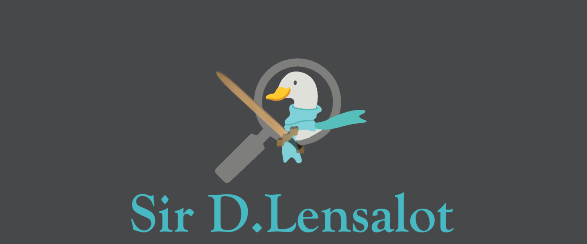

# D.Lensalot (formerly known as Lenscarf)

Curved-sky iterative CMB lensing tools based on [Scarf](https://github.com/samuelsimko/scarf)


known 'issues'
* interpolation of the deflection vector gets poorer very very close to the poles not great (a couple of pixels)
  (could e.g. perform it exactly or almost exactly there instead, or use polar interpolation with scipy.interpolate.inter2pd,
  or just rescale the thing around the pole by ephi?)


## Use on NERSC

To use D.lensalot on NERSC, you need to load some libraries as well as the GNU compilers (the default ones being Intel), before installing the module.
Type these lines in the terminal or include them into your `~/.bash_profile`:

```
module load fftw
module load gsl
module load cfitsio
module swap PrgEnv-intel PrgEnv-gnu
module load python
```


