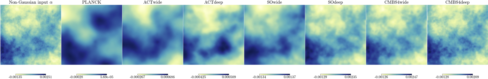

[](https://github.com/NextGenCMB/delensalot/actions/workflows/install.yaml)
[](https://delensalot.readthedocs.io/en/latest/?badge=latest)
[](https://github.com/NextGenCMB/delensalot/actions/workflows/integration_filter.yaml)
[](https://github.com/NextGenCMB/delensalot/actions/workflows/integration_reconstruction.yaml)
[](https://github.com/NextGenCMB/delensalot/actions/workflows/integration_tutorial.yaml)
[](https://arxiv.org/abs/2310.06729)

# delensalot
Curved-sky iterative CMB lensing reconstruction and bias calculation.

If you use delensalot for your work, please consider citing the ApJ publication [CMB-S4: Iterative internal delensing and r constraints](https://iopscience.iop.org/article/10.3847/1538-4357/ad2351).



# Installation
Download the project, navigate to the root folder and execute the command,

``` 
python setup.py install
```

Make sure that you have the latest `plancklens` and that you are using the `plancklensdev` branch
```
cd plancklens
git checkout plancklensdev
```
This is needed to give delensalot control over plancklens's mpi implementation, which we conveniently set up at this branch.

You will need to install `jupyter` for the tutorials found in `first_steps/notebooks/`, and possibly an `ipykernel` to create a jupyter-kernel out of the environment in which you install `delensalot`.

### Set up a jupyter-kernel with delensalot

To run the tutorials with a jupyter kernel, you will have to install delensalot in it. Assuming you are using conda for your package management,

```
conda create --name delensalot
conda activate delensalot
```

Then, install your favourite packages,

```
conda install pip, numpy
```

Now, go to the delensalot directory, and install, including its requirements,

```
cd </path/to/delensalot>
python3 -m pip install -r requirements .
python3 setup.py develop
```

Eventually, create your kernel using the environment at which you just installed all packages,
```
python3 -m ipykernel install --user --name=delensalot
```

## Installation troubles

Frequent problems are
 * `attrs`. If there are errors related to the metamodel, make sure you have `attrs` (not `attr`, which is a different package) installed and updated/upgraded (version 23.1.0 should do)
 * `astropy`. If there are errors related to ducc0, chances are it's because of an old `astropy` installation. Make sure you have the latest `astropy`.

# Usage

## parameter file
Check the first_steps/parameter_files/ and run any of them using,
``` 
python3 <parfile>.py
```

## Run a configuration file

To run a configuration file `<path-to-config/conf.py>`, type in your favorite `bash`,
``` 
python3 run.py -r <path-to-config/conf.py>
```

delensalot supports MPI,

```
srun --nodes <nnodes> -n <taskspernode> python3 run.py -r <path-to-config/conf.py>
```

## interactive mode

delensalot supports interactive mode. See `first_steps/notebooks/` for our tutorials.


## help

Type `python3 run.py [-h]` for quickhelp,
```
usage: run.py [-h] [-p NEW] [-r RESUME] [-s STATUS] [-purgehashs PURGEHASHS]

delensalot entry point.

optional arguments:
  -h, --help            show this help message and exit
  -r RESUME             Absolute path to config file to run/resume.
  -s STATUS             Absolute path for the analysis to write a report.

```


# Dependencies

 uses
  * [Plancklens](https://github.com/carronj/plancklens)
  * [lenspyx](https://github.com/carronj/lenspyx)
  * [DUCC](https://github.com/mreineck/ducc)

## Doc
Documentation may be found [HERE]


## Use with HPC
`delensalot` can be computationally demanding.
We have parallelized the computations across the simulation index in most cases. Assuming you have MPI set up and `srun` is available, you can simply run MPI-supported `delensalot` via,

```
srun -MPI_paramX X -MPI_paramY Y python3 <path-to-delensalot>/run.py -r <path-to-config-file>
```

If you have troubles, your HPC-center can help.
