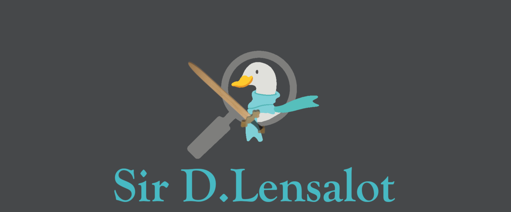
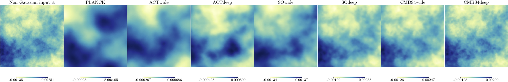

[](https://github.com/NextGenCMB/delensalot/actions/workflows/install_matrix.yaml)
[](https://github.com/NextGenCMB/delensalot/actions/workflows/smoke_test.yaml)
[](https://delensalot.readthedocs.io/en/latest/?badge=latest)
[](https://arxiv.org/abs/2310.06729)

# delensalot
Curved-sky optimal CMB lensing reconstruction and bias calculation.
Delensalot takes an observed CMB map and returns an optimal estimate of the underlying lensing field.

If you use delensalot for your work, please consider citing the ApJ publication [CMB-S4: Iterative internal delensing and r constraints](https://iopscience.iop.org/article/10.3847/1538-4357/ad2351).


This figure shows the full sky optimal lensing potential reconstruction for various CMB observations in a 5 times 5 degree patch. The input lensing potential is shown in the leftmost figure.

## Features
 * Curved-sky analysis
 * Anisotropic noise model support
 * Masked-sky support
 * Quadratic estimator (QE) implementation via Plancklens
 * Mock data generation using lenspyx
 * Supports various estimators (TT, EE, BB, MV, EE+EB, ..)


# Installation

Requires Python 3.9–3.12. First install the two dependencies that are not on PyPI:

```bash
pip install git+https://github.com/carronj/plancklens
pip install git+https://github.com/carronj/lenspyx
```

> **Note:** building `plancklens` requires a Fortran compiler (`gfortran`).
> On macOS: `brew install gcc`. On Linux: `sudo apt-get install gfortran`.

Then install delensalot:

```bash
git clone https://github.com/NextGenCMB/delensalot.git
cd delensalot
pip install -e .
```

To verify your installation:

```bash
python check_install.py
```

## Setting up a conda environment

```bash
conda create --name delensalot python=3.11
conda activate delensalot
conda install pip numpy

pip install git+https://github.com/carronj/plancklens
pip install git+https://github.com/carronj/lenspyx

cd </path/to/delensalot>
pip install -e .
```

To use delensalot in Jupyter notebooks, add it as a kernel:

```bash
pip install ipykernel
python -m ipykernel install --user --name=delensalot
```

## Installation troubleshooting

* **`attrs` errors** — make sure you have the `attrs` package (not `attr`, which is different): `pip install --upgrade attrs`. Version 23.1.0 or newer is required.
* **`astropy` / `ducc0` errors** — usually caused by an outdated `astropy`. Run `pip install --upgrade astropy`.
* **`plancklens` build fails** — make sure `gfortran` is installed (see above).
* **Still stuck?** — run `python check_install.py` for a full dependency report with fix hints.


# Usage

## Interactive mode

See `first_steps/notebooks/` for tutorials. The minimal working example notebook `interactive_mwe.ipynb` is a good starting point.

## Parameter files

```bash
python3 <parfile>.py
```

See `first_steps/parameter_files/` for examples.

## MPI / HPC

delensalot supports MPI for parallelisation across simulation indices:

```bash
srun -n <ntasks> python3 run.py -r <path-to-config-file>
```


# Dependencies

* [Plancklens](https://github.com/carronj/plancklens)
* [lenspyx](https://github.com/carronj/lenspyx)
* [DUCC](https://github.com/mreineck/ducc)
* numpy, scipy, healpy, astropy, attrs, psutil, logdecorator


# Documentation

Documentation can be found at [delensalot.readthedocs.io](https://delensalot.readthedocs.io).